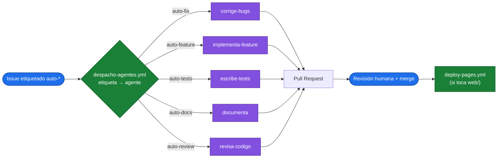

# 🧱 Arquitectura del proyecto

POC de **agentes nativos de GitHub Copilot** automatizados con **GitHub Actions**. Dos
piezas: un workflow que **despacha** agentes al etiquetar issues, y otro que **despliega**
la web demo. La IA vive solo en los agentes; los workflows son deterministas.

---

## 1) Componentes

| Ruta | Rol |
|---|---|
| `.github/agents/*.md` | Instrucciones de cada agente nativo (`corrige-bugs`, `implementa-feature`, `escribe-tests`, `documenta`, `revisa-codigo`). |
| `.github/workflows/despacho-agentes.yml` | Mapea etiquetas `auto-*` → agente y lo lanza vía API. |
| `.github/workflows/deploy-pages.yml` | Publica `web/` en GitHub Pages en cada push a `main`. |
| `web/` | App demo estática (calculadora de propina). |

---

## 2) Flujo de despacho (`despacho-agentes.yml`)

Disparador: `issues: labeled` cuando la etiqueta empieza por `auto-`.

**Leyenda:** 🔵 acción humana · 🟢 workflow YAML (sin IA) · 🟣 agente de IA

Secuencia:
1. El workflow traduce **etiqueta → agente** con un `case` de bash (determinista, sin IA):
   - `auto-fix` → `corrige-bugs`
   - `auto-feature` → `implementa-feature`
   - `auto-tests` → `escribe-tests`
   - `auto-docs` → `documenta`
   - `auto-review` → `revisa-codigo`
2. Construye un prompt con el título/cuerpo del issue y una instrucción de seguir
   `.github/agents/<agente>.md`.
3. Llama a `POST /agents/repos/{owner}/{repo}/tasks` (API de tareas del agente, en preview).
4. El agente de Copilot trabaja en la nube, crea una rama `copilot/…` y **abre un PR**.
5. El workflow deja un comentario de confirmación en el issue.

**Requisito clave:** el secret `COPILOT_AGENT_PAT` debe ser un **PAT classic con scope
`repo`**. El `GITHUB_TOKEN` del workflow (server-to-server) **no** sirve para esa API, y los
tokens **fine-grained** tampoco (devuelven 403).

---

## 3) Flujo de despliegue (`deploy-pages.yml`)

Disparador: `push` a `main` que toque `web/**` (o `workflow_dispatch`).

Usa las actions oficiales de Pages (`configure-pages`, `upload-pages-artifact`,
`deploy-pages`) para publicar la carpeta `web/`. No hay IA: es CI/CD normal. Cuando un
agente arregla algo en `web/` y se mergea el PR, este workflow **redespliega** y el cambio
se ve en vivo.

---

## 4) Separación de responsabilidades (lo importante de entender)

- **Orquestación (workflows YAML):** decide QUÉ agente y CUÁNDO. Determinista, sin IA.
- **Trabajo (agente de Copilot):** el razonamiento y el cambio de código. Aquí está la IA.
- **Decisión final (humano):** revisa y mergea el PR. El agente nunca escribe en `main`.

---

## 5) Límites intencionales

- Los agentes trabajan sobre la **realidad del repo**: si pides arreglar algo ya resuelto,
  no fallan pero producen trabajo redundante (por eso el humano revisa antes de mergear).
- La API de tareas de agentes está **en preview** y puede cambiar.
- El despacho es un mapa fijo etiqueta→agente; para lógica más rica habría que ampliarlo.

Guía de uso paso a paso en [`V2-NATIVA.md`](V2-NATIVA.md).
