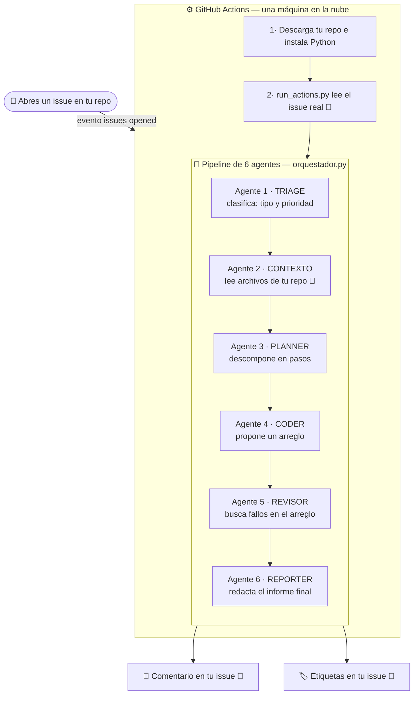
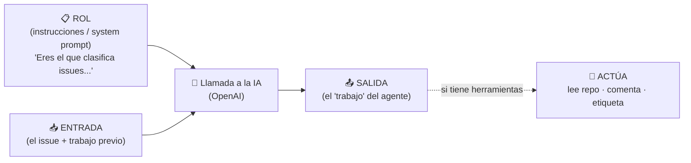
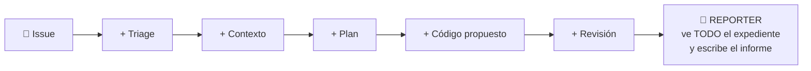
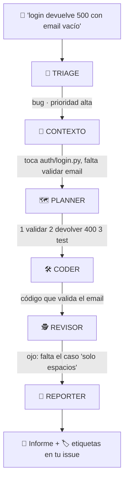

# 🗺️ Cómo funciona la POC (diagramas)

> GitHub dibuja estos diagramas automáticamente. Si ves código raro en vez de un
> dibujo, asegúrate de estar viendo el archivo en github.com (no en un editor local).

---

## 1. Vista general: del issue al comentario

Qué pasa desde que abres un issue hasta que el equipo de agentes te responde.
🔧 = el agente usa una **herramienta** (toca el mundo real: lee repo, comenta, etiqueta).

---

## 2. Qué ES un agente (la idea que desmitifica todo)

Un agente no es un programa complejo. Son tres piezas:

> **Consecuencia clave:** cambiar el comportamiento de un agente = cambiar su texto de
> instrucciones (en `agentes/roles.py`). No hay más magia.

---

## 3. El "expediente que crece" (por qué es multi-agente y no un solo chat)

Cada agente recibe el issue **más el trabajo de todos los anteriores**. El expediente
se va llenando. Esto se llama *handoff* (traspaso).

El **Revisor (agente 5)** tiene delante lo que escribió el **Coder (agente 4)** y su
trabajo es **criticarlo**. Un agente vigilando a otro: *ese* es el motivo de usar varios
agentes en lugar de uno solo — se pillan los errores entre ellos.

---

## 4. Ejemplo real recorriendo la cadena

Issue de ejemplo: *"El login devuelve 500 cuando el email está vacío"*

---

## 5. Qué archivo es cada cosa

| Archivo | Qué representa | Concepto |
|---------|----------------|----------|
| `agentes/roles.py` | Los 6 agentes (sus instrucciones) | **Qué es un agente** ← empieza aquí |
| `agentes/orquestador.py` | La cadena de montaje | **Orquestación / handoff** |
| `agentes/llm.py` | Cómo se habla con la IA | La llamada al modelo |
| `agentes/github_tools.py` | Leer repo, comentar, etiquetar | **Herramientas (tool use)** |
| `run_local.py` | Botón "probar en mi PC" | Ejecución local |
| `run_actions.py` | Botón que pulsa la nube | Ejecución en Actions |
| `.github/workflows/agentes.yml` | El vigilante que lo dispara | El disparador (evento → agentes) |
