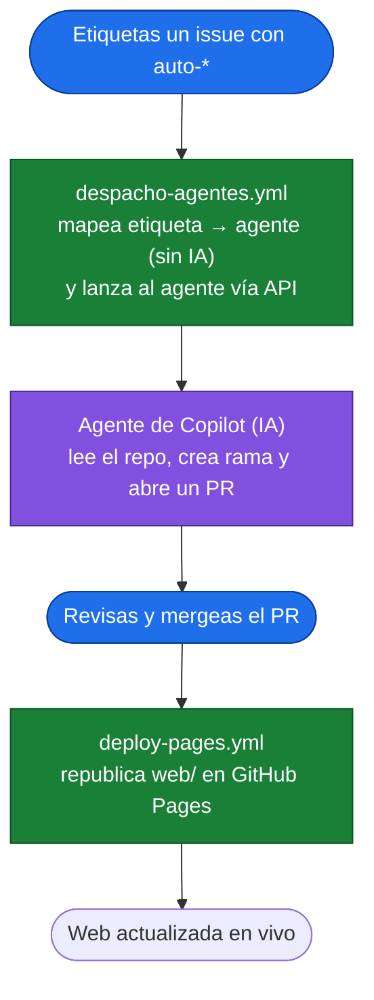

# POC: Agentes nativos de GitHub Copilot + workflows

> Una prueba de concepto **ejecutable** para aprender cómo funcionan los **agentes
> nativos de GitHub Copilot** y cómo automatizarlos con **GitHub Actions**: etiquetas un
> issue → un workflow despacha al agente adecuado → el agente corrige/documenta el código
> y **abre un Pull Request** → tú revisas y mergeas.

🌐 **Demo desplegada:** https://vmfernandezg.github.io/poc-agentes-github/

---

## 1. Qué es esto (y qué NO)

Estos agentes son el **GitHub Copilot Coding Agent** (producto nativo de GitHub), no un
sistema construido por nosotros. Un "agente personalizado" aquí es simplemente un archivo
Markdown en `.github/agents/` que define **cómo debe comportarse** el agente; GitHub Copilot
lo ejecuta en la nube y abre un PR.

> **La idea clave:** el trabajo *inteligente* lo hace el agente (IA). La *orquestación* que
> decide qué agente lanzar es un workflow **determinista** (un simple mapa etiqueta→agente,
> sin IA). Dos piezas separadas.

---

## 2. Cómo funciona (flujo completo)



**Leyenda:** 🔵 acción humana · 🟢 workflow YAML (sin IA) · 🟣 agente de IA

En texto:
1. **[TÚ]** Abres un issue y le pones una etiqueta `auto-*` (el disparador es la **etiqueta**).
2. **[YAML]** `despacho-agentes.yml` mapea la etiqueta → un agente (determinista, **sin IA**) y lo lanza.
3. **[IA]** El agente de Copilot lee el repo, crea una rama y **abre un Pull Request**.
4. **[TÚ]** Revisas y mergeas el PR.
5. **[YAML]** `deploy-pages.yml` republica la web en GitHub Pages (solo si tocaste `web/`).

---

## 3. Los agentes (`.github/agents/`)

| Agente | Qué hace | Etiqueta que lo dispara |
|--------|----------|-------------------------|
| `corrige-bugs` | Corrige un bug con el cambio mínimo + test | `auto-fix` |
| `implementa-feature` | Implementa una funcionalidad pequeña | `auto-feature` |
| `escribe-tests` | Añade tests (casos normales y límite) | `auto-tests` |
| `documenta` | Mejora documentación (sin tocar lógica) | `auto-docs` |
| `revisa-codigo` | Revisa y reporta problemas por severidad | `auto-review` |

Editar el `.md` de un agente cambia su comportamiento. Añadir uno nuevo = copiar el patrón
y mapear una etiqueta en `despacho-agentes.yml`.

---

## 4. Estructura del repo

```
.github/
├── agents/                     # los agentes nativos (sus instrucciones)
│   ├── corrige-bugs.md
│   ├── implementa-feature.md
│   ├── escribe-tests.md
│   ├── documenta.md
│   └── revisa-codigo.md
└── workflows/
    ├── despacho-agentes.yml    # etiqueta issue → lanza el agente (abre PR)
    └── deploy-pages.yml        # publica web/ en GitHub Pages
web/                            # app demo estática (calculadora de propina)
ARQUITECTURA.md · CONTRIBUTING.md · V2-NATIVA.md · DEMO-PAGES.md
```

---

## 5. Puesta en marcha

### 5.1. Requisito: el secret `COPILOT_AGENT_PAT`
La API que lanza a los agentes **solo acepta un PAT classic con scope `repo`** (los
fine-grained NO funcionan, y el `GITHUB_TOKEN` normal tampoco).

1. Crea un token classic: https://github.com/settings/tokens/new → scope **`repo`**.
2. Guárdalo como secret: `gh secret set COPILOT_AGENT_PAT --repo TU_USUARIO/TU_REPO`.

### 5.2. Probar el flujo
1. Abre un issue describiendo un bug o tarea.
2. Ponle una etiqueta `auto-*` (p. ej. `auto-fix`).
3. Mira la pestaña **Actions** → *Despacho de agentes IA*.
4. A los pocos minutos aparece un **Pull Request** del agente. Revísalo y mergéalo.

Detalles en [`V2-NATIVA.md`](V2-NATIVA.md). Despliegue en [`DEMO-PAGES.md`](DEMO-PAGES.md).

### 5.3. Ejecutar tests de la calculadora

```bash
npm test
```

Esto ejecuta los tests de `web/app.js` con el runner nativo de Node (`node --test`).

---

## 6. Aprendizajes clave

- **Un agente nativo = un archivo `.md`** en `.github/agents/`. No hay que programar nada.
- **El despacho es determinista** (etiqueta→agente); la IA está solo en el agente.
- **El agente propone (PR), el humano dispone** (revisa y mergea). Nunca escribe en `main`.
- **La API de agentes exige un PAT classic `repo`** (no fine-grained, no `GITHUB_TOKEN`).
- Si el cambio toca `web/`, al mergear **GitHub Pages redespliega solo** y lo ves en vivo.

Más detalle de diseño en [`ARQUITECTURA.md`](ARQUITECTURA.md) · cómo contribuir en
[`CONTRIBUTING.md`](CONTRIBUTING.md).

## FAQ

**¿Por qué el PAT debe ser classic y no fine-grained?**  
Porque la API usada para despachar agentes en esta POC requiere un PAT classic con scope `repo`; ni los fine-grained ni el `GITHUB_TOKEN` estándar funcionan en ese flujo.

**¿Qué hace el workflow de despacho?**  
`despacho-agentes.yml` escucha etiquetas `auto-*`, mapea cada etiqueta al agente correspondiente y dispara su ejecución para que prepare cambios y abra un PR.

**¿Cómo se cierra el issue "solo"?**  
Cuando el PR del agente se mergea, GitHub puede cerrar automáticamente el issue si el PR incluye una referencia de cierre (por ejemplo, `Closes #15`) en su descripción o commits.
